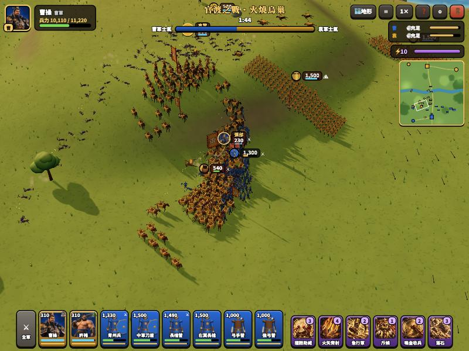
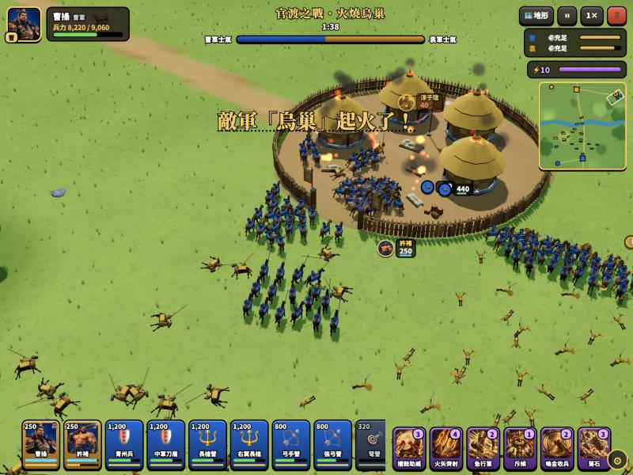
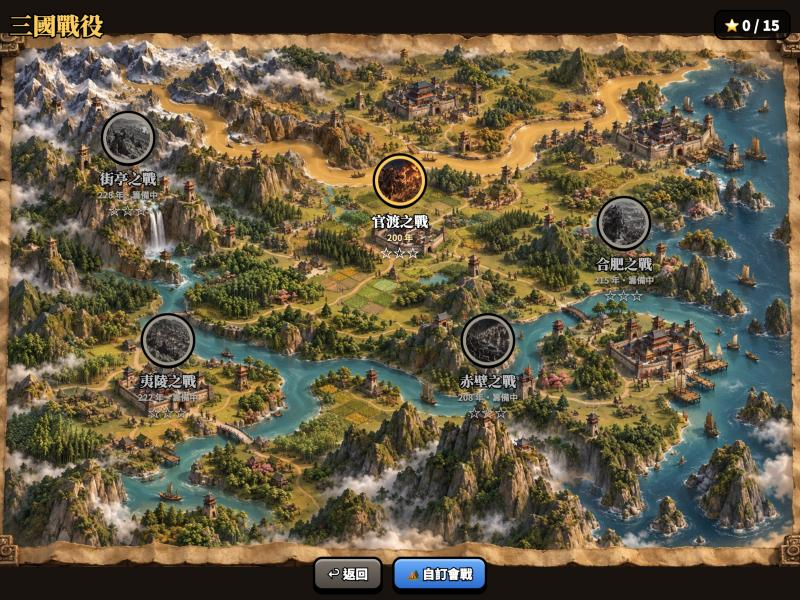
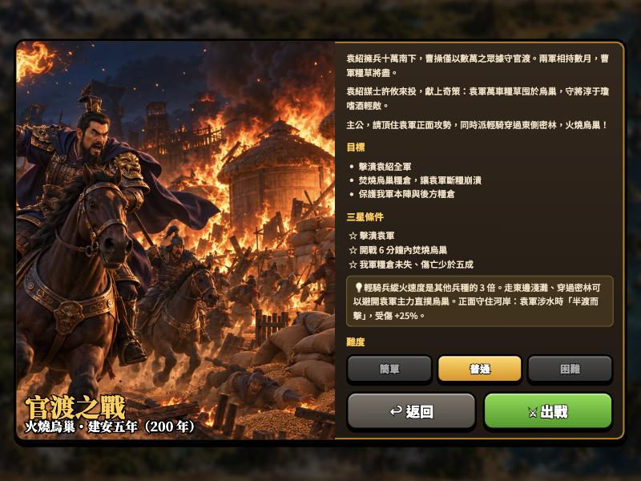
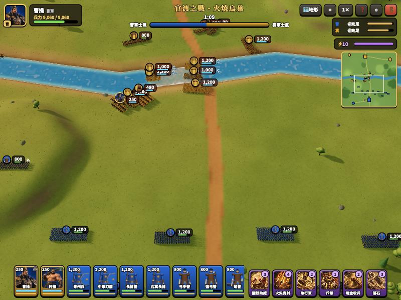
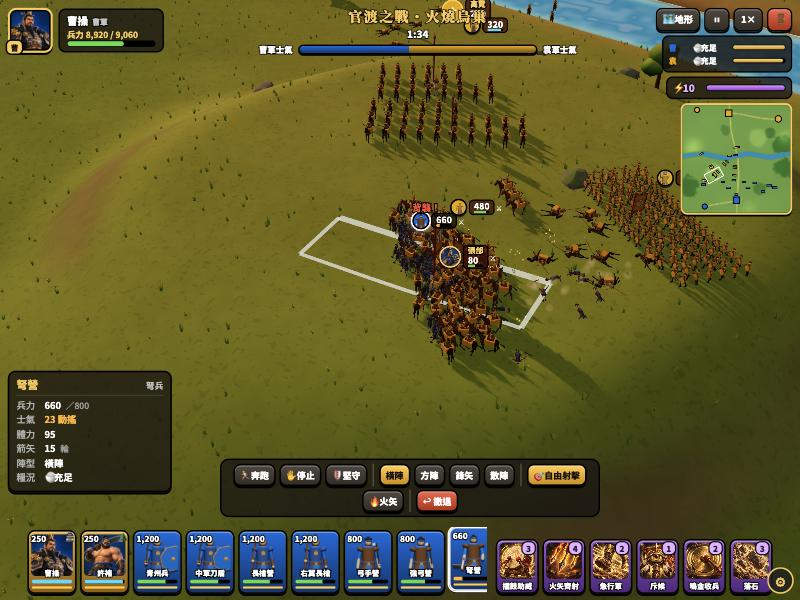

# 千軍令 — 三國戰役指揮（warGame）

3D 三國真實戰役指揮遊戲：不蓋房子、不採集，你就是一場會戰的主帥。指揮數千名士兵佈陣、包抄、衝鋒，派奇兵燒掉敵軍糧倉，看著敵軍士氣崩潰全線潰逃。美術與介面參考部落戰爭 Clash of Clans。

規劃書：[`docs/`](docs/00-專案總覽.md)

| 千軍對撞 | 火燒烏巢 |
|---|---|
|  |  |
| **戰役地圖** | **戰前簡報** |
|  |  |
| **半渡而擊** | **軍團資訊與背襲警示** |
|  |  |

**線上試玩**：https://wenbatman33.github.io/warGame/ （已上線；推到 main 約 1–2 分鐘後自動更新。網址加 `?dev=1`，按 ` 鍵或右下齒輪開 DEV 微調工具）

## 進度

- [x] M0 規劃書與骨架
- [x] M1 千軍戰場：程式產生地形／河流／淺灘、水面、樹木岩石草叢、骨骼動畫貼圖士兵（一兵種一次 draw call）、營寨與糧倉模型、粒子
- [x] M2 軍團指揮：陣型（橫陣／方陣／鋒矢／散陣）、A* 尋路、點選／框選／卡片選取、右鍵移動／攻擊、右鍵拖曳畫戰線、觸控操作、DEV 微調工具
- [x] M3 戰鬥與士氣：前排接戰的戰線肉搏、側擊／背襲（依陣形方位）、箭雨（盾牌擋箭、兩極化箭傷）、騎兵衝鋒與拒馬、士氣／潰逃／重整／連鎖崩潰、體力、武將光環與 12 種武將技、地形優勢（高地、半渡而擊、森林、營寨）、平衡測試 `BALANCE=1 npx vitest run tests/balance.test.ts`
- [x] M4 糧草與 AI：糧倉、本陣、輜重車（拖車馬）、縱火與火勢、軍心大亂、斷糧逃兵、柵欄營門、敵軍指揮官 AI（進攻、騎兵衝鋒循環、劫糧、守倉、武將技）、視野與伏兵、黃昏／夜晚光影與火光
- [x] M5 介面：主選單、戰役地圖、戰前簡報（難度）、讀取畫面、部署階段、軍團卡、兵力徽章、營寨名牌、計策卡、小地圖、軍師提示、結算三星、設定、操作說明、自訂會戰、進度存檔
- [x] M6 真實戰役（九場）：白馬之圍（教學）、虎牢關（三英戰呂布）、官渡（燒烏巢、張郃高覽倒戈）、長坂坡（據水斷橋、關羽援軍）、赤壁（夜戰、東風火燒連營、燃燒戰船）、合肥（以寡擊眾、斬孫權）、定軍山（居高臨下斬夏侯淵）、夷陵（火燒連營連鎖延燒）、街亭（奪水源斷水）＋ 自訂會戰
- [x] 進階：陣法（一字長蛇／鶴翼／鋒矢／方圓）、武將單挑、敵軍會用計策、戰功榜、三星目標面板、鏡頭跟隨（C）、拍照模式（Shift＋H）、戰場踐踏、援軍
- [x] M7 打磨：3D 兵種卡圖示、士兵遠近 LOD、軍團軍旗、騎兵揚塵、難度係數、軍團資訊面板與戰場警示（背襲／側擊／半渡）、平衡測試

交接說明、攻略與「啟用線上版」步驟：[`docs/07-開發紀錄與交接.md`](docs/07-開發紀錄與交接.md)

## 開發

```bash
npm install
npm run dev      # http://localhost:5200
npm test
npm run build
```
